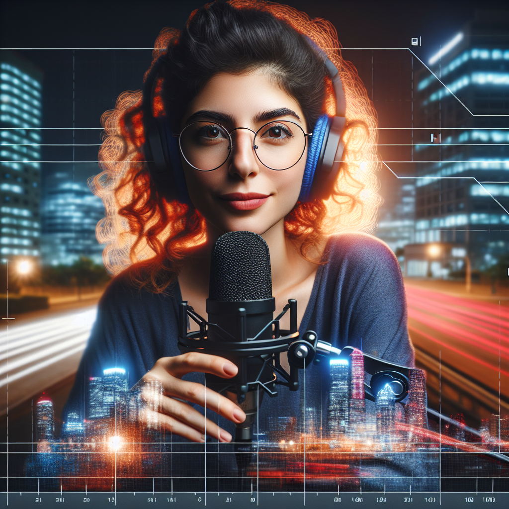

Podcast: Descobrindo IAs Generativas 🎙️
📒 Descrição
Este podcast oferece um passeio rápido, pelo mundo das IAs Generativas e sua influência na tecnologia moderna.

## 💻 Tecnologias utilizadas no projeto

- [ChatGPT](https://chat.openai.com/) 
- [Glif.app](https://https://glif.app/)
- [ElevenLabs](https://beta.elevenlabs.io/)
- [Capcut](https://www.capcut.com/pt-br/)

## ✨ Como foi feito ?

- Roteiro gerado via chatgpt
- Audio gerado pela elevenLabs
- Glif Para gerar a capa
- Capcut para tratar aúdio e adicionar sons de fundo

🚀 Resultados
O episódio é uma introdução acessível e estimulante ao campo das IAs Generativas, ideal para quem busca uma compreensão rápida do assunto.

LINK PARA O PODCAST AQUI: [IAS GENERATIVAS](https://file.notion.so/f/f/3ec1be94-52ac-4845-adf7-f873e65842dc/4238cded-031b-478c-a9fc-c8a73957f990/IAS_GERENATIVAS_1.mp3?id=01ea633d-53d4-4a70-ac67-e05a6c4b6a4d&table=block&spaceId=3ec1be94-52ac-4845-adf7-f873e65842dc&expirationTimestamp=1719532800000&signature=2K9eOSlghWqFtXzrQ9la829Sn2pSaD9Gt9hZjuqffaE&downloadName=IAS+GERENATIVAS+1.mp3)

💭 Reflexão
O projeto destacou a versatilidade das IAs Generativas na criação de conteúdo auditivo, abrindo novos caminhos para a produção de mídia digital.
